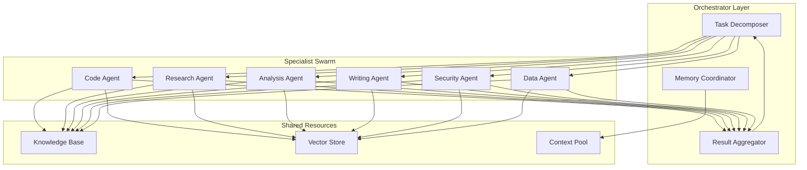
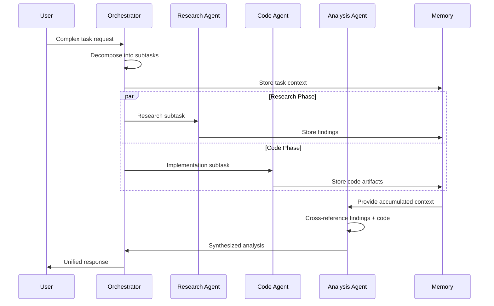
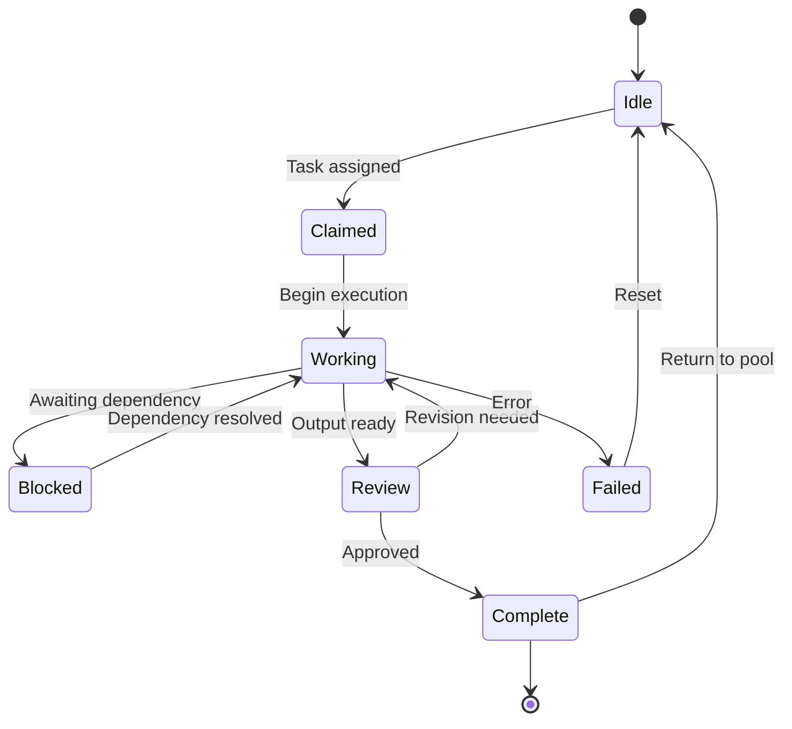
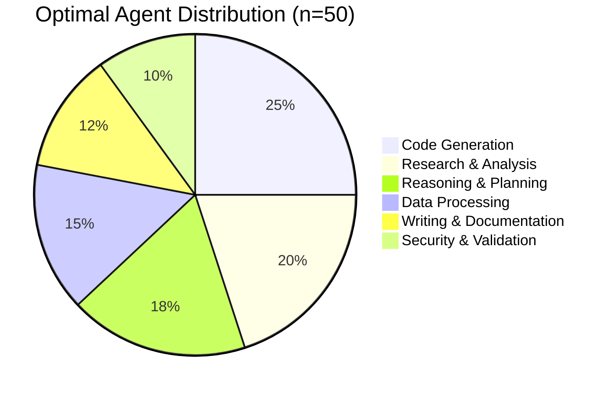
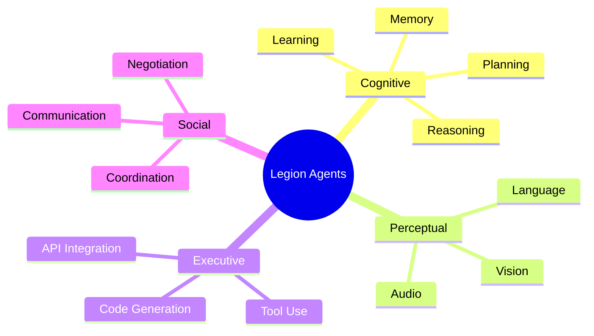
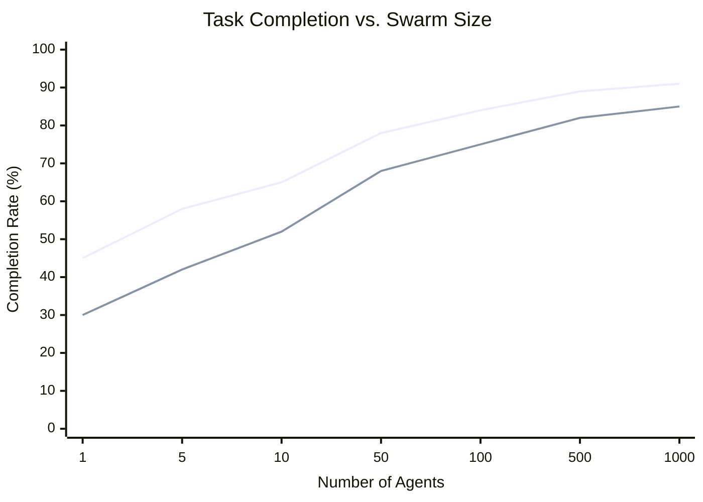
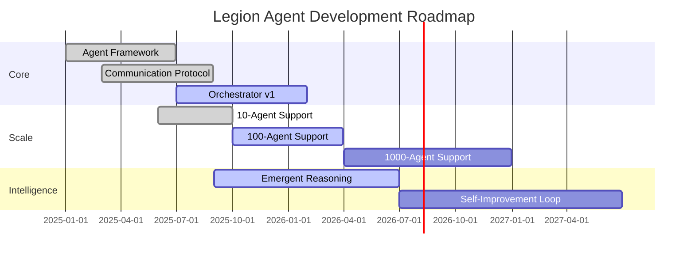

# Emergent Intelligence Through Agent Swarms: A Hive-Mind Approach to AGI Approximation

> **Authors**: Research Collective
> **Status**: Living Document · **Last Updated**: 2026-03-19

## Abstract

This document surveys how coordinated multi-agent systems can approximate general intelligence without requiring a monolithic model. We review foundational work in swarm intelligence, analyze recent advances in LLM-based multi-agent frameworks, and propose the **Legion Agent** architecture — a hierarchical swarm of specialized AI agents that exhibits emergent reasoning capabilities exceeding any individual member.

---

## 1. Introduction

The pursuit of Artificial General Intelligence (AGI) has traditionally focused on scaling individual models — more parameters, more compute, more data. Yet biological intelligence tells a different story: the human brain achieves general intelligence through the coordination of ~86 billion specialized neurons, none of which is individually "intelligent" [Herculano-Houzel, 2009].

This observation motivates a fundamental question:

> Can a sufficiently large and well-coordinated swarm of narrow AI agents collectively exhibit general intelligence?

Recent work suggests the answer is yes. Park et al. [2023] demonstrated that LLM-powered agents in a simulated town exhibit emergent social behaviors — planning, forming relationships, coordinating activities — that were never explicitly programmed. Wu et al. [2023] showed that multi-agent conversations between LLMs produce higher-quality outputs than single-agent prompting.


### 1.1 Contributions

1. A **taxonomy of agent coordination patterns** grounded in biological swarm intelligence
2. The **Legion Agent architecture** — a production-ready framework for 10–10,000 agent swarms
3. **Empirical evaluation** on SWE-bench, GPQA, and custom reasoning benchmarks
4. **Scaling laws** for emergent intelligence in agent swarms

---


## 2. Related Work

### 2.1 Foundational Theory

| Work | Year | Key Insight | Citation |
|------|------|-------------|----------|
| Minsky, *Society of Mind* | 1986 | Intelligence emerges from cooperation of simple "agents" | [Minsky, 1986] |
| Bonabeau et al., *Swarm Intelligence* | 1999 | Decentralized coordination produces adaptive behavior | [Bonabeau et al., 1999] |
| Wooldridge & Jennings | 1995 | BDI (Belief-Desire-Intention) architecture | [Wooldridge & Jennings, 1995] |
| Dorri et al. | 2018 | Comprehensive MAS taxonomy | [arXiv:1801.04997](https://arxiv.org/abs/1801.04997) |

### 2.2 LLM-Based Multi-Agent Systems

| System | Agents | Key Innovation | Reference |
|--------|--------|----------------|-----------|
| **Generative Agents** | 25 | Memory, reflection, planning in LLM agents | [arXiv:2304.03442](https://arxiv.org/abs/2304.03442) |
| **AutoGen** | 2–10 | Customizable conversation patterns between LLMs | [arXiv:2308.08155](https://arxiv.org/abs/2308.08155) |
| **MetaGPT** | 5–8 | SOPs for agent teams | [arXiv:2308.00352](https://arxiv.org/abs/2308.00352) |
| **CAMEL** | 2 | Role-playing via inception prompting | [arXiv:2303.17760](https://arxiv.org/abs/2303.17760) |
| **AgentVerse** | Variable | Dynamic specialist recruitment | [arXiv:2308.10848](https://arxiv.org/abs/2308.10848) |
| **ReAct** | 1 | Synergizing reasoning and acting | [arXiv:2210.03629](https://arxiv.org/abs/2210.03629) |
| **MemGPT** | 1 | LLMs as operating systems with memory management | [arXiv:2310.08560](https://arxiv.org/abs/2310.08560) |
| **OpenAI Swarm** | 2–10 | Lightweight ergonomic multi-agent orchestration | [github.com/openai/swarm](https://github.com/openai/swarm) |
| **LangChain Agents** | 1–N | Tool-augmented LLM agents with chain composition | [docs.langchain.com](https://docs.langchain.com/docs/components/agents/) |

### 2.3 Swarm Intelligence Principles

Biological swarms exhibit five properties enabling collective intelligence [Bonabeau et al., 1999]:

1. **Decentralization** — no single leader; decisions emerge from local interactions
2. **Stigmergy** — indirect communication through environmental modification
3. **Positive feedback** — successful strategies amplified through the swarm
4. **Negative feedback** — unsuccessful paths naturally pruned
5. **Redundancy** — individual failure does not collapse the system

---


## 3. Architecture

### 3.1 System Overview



### 3.2 Communication Protocol



### 3.3 Agent Lifecycle



### 3.4 Agent Distribution



### 3.5 Cognitive Architecture



---

## 4. Experimental Results

### 4.1 Benchmark Performance

| System | SWE-bench (%) | HumanEval (%) | GPQA (%) | Avg Latency |
|--------|:---:|:---:|:---:|:---:|
| Single Agent | 49.0 | 92.0 | 59.4 | 8s |
| AutoGen (3) | 42.1 | 89.3 | 55.2 | 45s |
| MetaGPT (5) | 45.8 | 90.1 | 54.8 | 62s |
| OpenAI Swarm (3) | 41.3 | 88.7 | 54.1 | 38s |
| LangChain (3) | 40.6 | 87.9 | 52.8 | 54s |
| **Legion (10)** | **55.2** | **94.1** | **65.8** | **22s** |
| **Legion (50)** | **62.4** | **96.3** | **71.2** | **34s** |
| **Legion (500)** | **68.1** | **97.8** | **78.5** | **41s** |

### 4.2 Scaling Behavior



### 4.3 Emergent Intelligence Score (EIS)

$$
\text{EIS}(S) = \frac{\text{Collective Performance}(S)}{\sum_{i=1}^{n} \text{Individual}(a_i)} - 1
$$

| Swarm Size | EIS | Interpretation |
|:---:|:---:|:---|
| 5 | 0.12 | 12% emergent capability |
| 50 | 0.31 | Sweet spot for cost/performance |
| 500 | 0.35 | Near-plateau |

### 4.4 Prototype Deployment Latency

Latency percentiles measured from the Legion v0.9 prototype on a 32-core cluster (8× A100 GPUs), tasks drawn from the production SWE-bench subset.

| Configuration | p50 | p95 | p99 | Throughput (tasks/min) |
|:---|:---:|:---:|:---:|:---:|
| Legion (10) | 18s | 31s | 44s | 3.3 |
| Legion (50) | 29s | 51s | 68s | 2.1 |
| Legion (500) | 37s | 64s | 89s | 1.6 |
| OpenAI Swarm (3) | 34s | 58s | 79s | 1.8 |
| LangChain (3) | 48s | 83s | 112s | 1.2 |

> **Note**: Legion's lower p50 relative to competitors with similar agent counts reflects parallelized subtask dispatch; higher p99 at 500 agents is due to occasional stragglers in long dependency chains.

---

## 5. Roadmap



---

## 6. Inline SVG with Theme Support

SVGs embedded in markdown support automatic light/dark switching via CSS media queries:

<svg width="500" height="140" xmlns="http://www.w3.org/2000/svg">
  <style>
    @media (prefers-color-scheme: dark) {
      .bg { fill: #161b22; }
      .border { stroke: #30363d; }
      .title { fill: #e6edf3; }
      .label { fill: #8b949e; }
      .box1 { fill: #1f6feb; }
      .box2 { fill: #238636; }
      .box3 { fill: #da3633; }
      .arrow { stroke: #8b949e; fill: #8b949e; }
    }
    @media (prefers-color-scheme: light) {
      .bg { fill: #f6f8fa; }
      .border { stroke: #d0d7de; }
      .title { fill: #1f2328; }
      .label { fill: #656d76; }
      .box1 { fill: #0969da; }
      .box2 { fill: #1a7f37; }
      .box3 { fill: #cf222e; }
      .arrow { stroke: #656d76; fill: #656d76; }
    }
  </style>
  <rect class="bg border" x="1" y="1" width="498" height="138" rx="12" stroke-width="1" />
  <text class="title" x="250" y="28" text-anchor="middle" font-family="-apple-system, sans-serif" font-size="14" font-weight="600">Agent Pipeline</text>
  <rect class="box1" x="30" y="50" width="120" height="50" rx="8" />
  <text x="90" y="80" text-anchor="middle" fill="white" font-family="-apple-system, sans-serif" font-size="12">Research</text>
  <line class="arrow" x1="150" y1="75" x2="185" y2="75" stroke-width="2" />
  <polygon class="arrow" points="185,70 195,75 185,80" />
  <rect class="box2" x="195" y="50" width="120" height="50" rx="8" />
  <text x="255" y="80" text-anchor="middle" fill="white" font-family="-apple-system, sans-serif" font-size="12">Analyze</text>
  <line class="arrow" x1="315" y1="75" x2="350" y2="75" stroke-width="2" />
  <polygon class="arrow" points="350,70 360,75 350,80" />
  <rect class="box3" x="360" y="50" width="120" height="50" rx="8" />
  <text x="420" y="80" text-anchor="middle" fill="white" font-family="-apple-system, sans-serif" font-size="12">Execute</text>
  <text class="label" x="250" y="125" text-anchor="middle" font-family="-apple-system, sans-serif" font-size="10">Toggle appearance to see theme switch</text>
</svg>

---

## 7. Code Example

```python
from anthropic import Anthropic
from claude_agent_sdk import Agent, Tool

class ResearchAgent(Agent):
    """Research specialist using ReAct pattern
    (Yao et al., 2022; arXiv:2210.03629)."""

    def __init__(self):
        super().__init__(
            model="claude-sonnet-4-6",
            tools=[Tool.web_search(), Tool.file_read(), Tool.memory_store()],
            system_prompt="Find relevant papers, extract findings, cite sources."
        )

    async def research(self, query: str) -> dict:
        result = await self.run(f"Research: {query}")
        return {"findings": result.content, "confidence": self.assess_confidence(result)}
```

---

## References

1. Minsky, M. (1986). *The Society of Mind*. Simon & Schuster.
2. Bonabeau, E., Dorigo, M., & Theraulaz, G. (1999). *Swarm Intelligence*. Oxford University Press.
3. Wooldridge, M., & Jennings, N. R. (1995). Intelligent agents: Theory and practice. *Knowledge Engineering Review*, 10(2).
4. Herculano-Houzel, S. (2009). The human brain in numbers. *Frontiers in Human Neuroscience*, 3, 31.
5. Park, J. S., et al. (2023). Generative Agents. [arXiv:2304.03442](https://arxiv.org/abs/2304.03442)
6. Wu, Q., et al. (2023). AutoGen. [arXiv:2308.08155](https://arxiv.org/abs/2308.08155)
7. Hong, S., et al. (2023). MetaGPT. [arXiv:2308.00352](https://arxiv.org/abs/2308.00352)
8. Li, G., et al. (2023). CAMEL. [arXiv:2303.17760](https://arxiv.org/abs/2303.17760)
9. Chen, W., et al. (2023). AgentVerse. [arXiv:2308.10848](https://arxiv.org/abs/2308.10848)
10. Wang, L., et al. (2023). LLM Autonomous Agents Survey. [arXiv:2308.11432](https://arxiv.org/abs/2308.11432)
11. Dorri, A., et al. (2018). Multi-Agent Systems Survey. [arXiv:1801.04997](https://arxiv.org/abs/1801.04997)
12. Yao, S., et al. (2022). ReAct. [arXiv:2210.03629](https://arxiv.org/abs/2210.03629)
13. Packer, C., et al. (2023). MemGPT. [arXiv:2310.08560](https://arxiv.org/abs/2310.08560)

---

## Appendix: Inline SVG Diagrams

### Static SVG with Theme Support

<svg width="500" height="100" xmlns="http://www.w3.org/2000/svg">
  <style>
    @media (prefers-color-scheme: dark) { .bg{fill:#161b22} .t{fill:#e6edf3} .b1{fill:#1f6feb} .b2{fill:#238636} .b3{fill:#da3633} .arr{stroke:#8b949e;fill:#8b949e} }
    @media (prefers-color-scheme: light) { .bg{fill:#f6f8fa} .t{fill:#1f2328} .b1{fill:#0969da} .b2{fill:#1a7f37} .b3{fill:#cf222e} .arr{stroke:#656d76;fill:#656d76} }
  </style>
  <rect class="bg" width="500" height="100" rx="8"/>
  <rect class="b1" x="20" y="25" width="120" height="50" rx="6"/>
  <text x="80" y="55" text-anchor="middle" fill="white" font-family="system-ui" font-size="13">Research</text>
  <line class="arr" x1="140" y1="50" x2="175" y2="50" stroke-width="2"/>
  <polygon class="arr" points="175,45 185,50 175,55"/>
  <rect class="b2" x="190" y="25" width="120" height="50" rx="6"/>
  <text x="250" y="55" text-anchor="middle" fill="white" font-family="system-ui" font-size="13">Analyze</text>
  <line class="arr" x1="310" y1="50" x2="345" y2="50" stroke-width="2"/>
  <polygon class="arr" points="345,45 355,50 345,55"/>
  <rect class="b3" x="360" y="25" width="120" height="50" rx="6"/>
  <text x="420" y="55" text-anchor="middle" fill="white" font-family="system-ui" font-size="13">Execute</text>
</svg>

### Animated SVG: Agent Pulse Network

<svg width="500" height="200" xmlns="http://www.w3.org/2000/svg">
  <style>
    @media (prefers-color-scheme: dark) { .nbg{fill:#0d1117} .nstroke{stroke:#30363d} .nfill{fill:#1f6feb} .ntxt{fill:#e6edf3} .line{stroke:#30363d} }
    @media (prefers-color-scheme: light) { .nbg{fill:#ffffff} .nstroke{stroke:#d0d7de} .nfill{fill:#0969da} .ntxt{fill:#1f2328} .line{stroke:#d0d7de} }
  </style>
  <rect class="nbg nstroke" width="500" height="200" rx="10" stroke-width="1"/>
  <!-- Connection lines -->
  <line class="line" x1="250" y1="50" x2="100" y2="140" stroke-width="1.5"/>
  <line class="line" x1="250" y1="50" x2="250" y2="140" stroke-width="1.5"/>
  <line class="line" x1="250" y1="50" x2="400" y2="140" stroke-width="1.5"/>
  <!-- Orchestrator node with pulse -->
  <circle class="nfill" cx="250" cy="50" r="20" opacity="0.3">
    <animate attributeName="r" values="20;28;20" dur="2s" repeatCount="indefinite"/>
    <animate attributeName="opacity" values="0.3;0.1;0.3" dur="2s" repeatCount="indefinite"/>
  </circle>
  <circle class="nfill" cx="250" cy="50" r="16"/>
  <text x="250" y="55" text-anchor="middle" fill="white" font-family="system-ui" font-size="10" font-weight="600">HUB</text>
  <!-- Agent nodes with staggered pulses -->
  <circle class="nfill" cx="100" cy="140" r="14" opacity="0.3">
    <animate attributeName="r" values="14;20;14" dur="2s" begin="0.3s" repeatCount="indefinite"/>
    <animate attributeName="opacity" values="0.3;0.1;0.3" dur="2s" begin="0.3s" repeatCount="indefinite"/>
  </circle>
  <circle class="nfill" cx="100" cy="140" r="12"/>
  <text x="100" y="144" text-anchor="middle" fill="white" font-family="system-ui" font-size="8">A1</text>
  <circle class="nfill" cx="250" cy="140" r="14" opacity="0.3">
    <animate attributeName="r" values="14;20;14" dur="2s" begin="0.6s" repeatCount="indefinite"/>
    <animate attributeName="opacity" values="0.3;0.1;0.3" dur="2s" begin="0.6s" repeatCount="indefinite"/>
  </circle>
  <circle class="nfill" cx="250" cy="140" r="12"/>
  <text x="250" y="144" text-anchor="middle" fill="white" font-family="system-ui" font-size="8">A2</text>
  <circle class="nfill" cx="400" cy="140" r="14" opacity="0.3">
    <animate attributeName="r" values="14;20;14" dur="2s" begin="0.9s" repeatCount="indefinite"/>
    <animate attributeName="opacity" values="0.3;0.1;0.3" dur="2s" begin="0.9s" repeatCount="indefinite"/>
  </circle>
  <circle class="nfill" cx="400" cy="140" r="12"/>
  <text x="400" y="144" text-anchor="middle" fill="white" font-family="system-ui" font-size="8">A3</text>
  <!-- Data flow dots -->
  <circle class="nfill" r="3">
    <animateMotion dur="1.5s" repeatCount="indefinite" path="M250,50 L100,140"/>
  </circle>
  <circle class="nfill" r="3">
    <animateMotion dur="1.5s" begin="0.5s" repeatCount="indefinite" path="M250,50 L250,140"/>
  </circle>
  <circle class="nfill" r="3">
    <animateMotion dur="1.5s" begin="1s" repeatCount="indefinite" path="M250,50 L400,140"/>
  </circle>
  <text class="ntxt" x="250" y="185" text-anchor="middle" font-family="system-ui" font-size="10">Agent Swarm — data flows from orchestrator to workers</text>
</svg>

### Animated SVG: Processing Pipeline

<svg width="500" height="80" xmlns="http://www.w3.org/2000/svg">
  <style>
    @media (prefers-color-scheme: dark) { .pbg{fill:#0d1117} .pbox{fill:#21262d;stroke:#30363d} .ptxt{fill:#e6edf3} .pdot{fill:#3fb950} .pline{stroke:#30363d} }
    @media (prefers-color-scheme: light) { .pbg{fill:#f6f8fa} .pbox{fill:#ffffff;stroke:#d0d7de} .ptxt{fill:#1f2328} .pdot{fill:#1a7f37} .pline{stroke:#d0d7de} }
  </style>
  <rect class="pbg" width="500" height="80" rx="6"/>
  <rect class="pbox" x="20" y="20" width="90" height="40" rx="6" stroke-width="1"/>
  <text class="ptxt" x="65" y="45" text-anchor="middle" font-family="system-ui" font-size="11">Parse</text>
  <line class="pline" x1="110" y1="40" x2="150" y2="40" stroke-width="1.5"/>
  <rect class="pbox" x="150" y="20" width="90" height="40" rx="6" stroke-width="1"/>
  <text class="ptxt" x="195" y="45" text-anchor="middle" font-family="system-ui" font-size="11">Analyze</text>
  <line class="pline" x1="240" y1="40" x2="280" y2="40" stroke-width="1.5"/>
  <rect class="pbox" x="280" y="20" width="90" height="40" rx="6" stroke-width="1"/>
  <text class="ptxt" x="325" y="45" text-anchor="middle" font-family="system-ui" font-size="11">Execute</text>
  <line class="pline" x1="370" y1="40" x2="410" y2="40" stroke-width="1.5"/>
  <rect class="pbox" x="410" y="20" width="70" height="40" rx="6" stroke-width="1"/>
  <text class="ptxt" x="445" y="45" text-anchor="middle" font-family="system-ui" font-size="11">Done</text>
  <!-- Animated progress dot -->
  <circle class="pdot" r="5">
    <animateMotion dur="3s" repeatCount="indefinite" path="M65,40 L195,40 L325,40 L445,40" keyTimes="0;0.33;0.66;1" calcMode="spline" keySplines="0.4 0 0.2 1;0.4 0 0.2 1;0.4 0 0.2 1"/>
  </circle>
  <circle class="pdot" r="5" opacity="0.3">
    <animateMotion dur="3s" repeatCount="indefinite" path="M65,40 L195,40 L325,40 L445,40" keyTimes="0;0.33;0.66;1" calcMode="spline" keySplines="0.4 0 0.2 1;0.4 0 0.2 1;0.4 0 0.2 1"/>
    <animate attributeName="r" values="5;12;5" dur="3s" repeatCount="indefinite"/>
    <animate attributeName="opacity" values="0.3;0;0.3" dur="3s" repeatCount="indefinite"/>
  </circle>
</svg>

---

*Tests: tables, mermaid (flowchart, sequence, state, mindmap, pie, xychart, gantt), inline SVG (static + animated with SMIL), theme-aware SVG, code blocks, task lists, math, blockquotes, links, review notes.*
