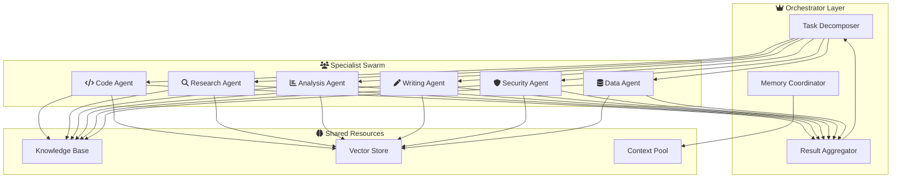
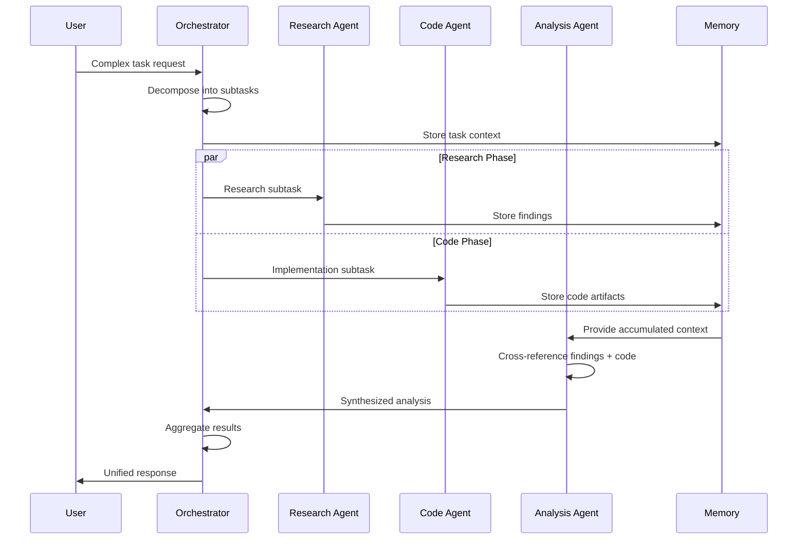
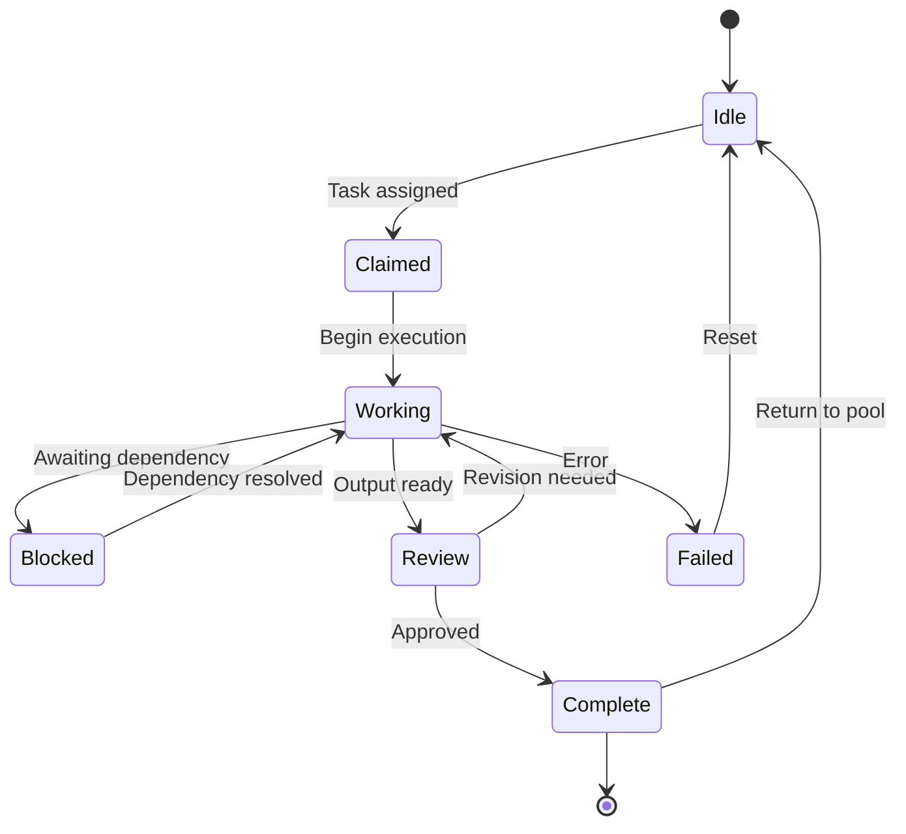
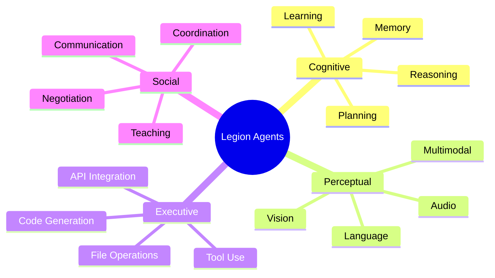
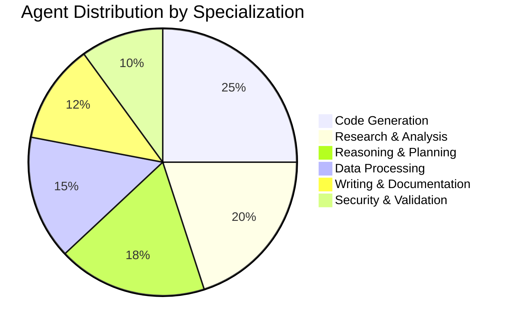
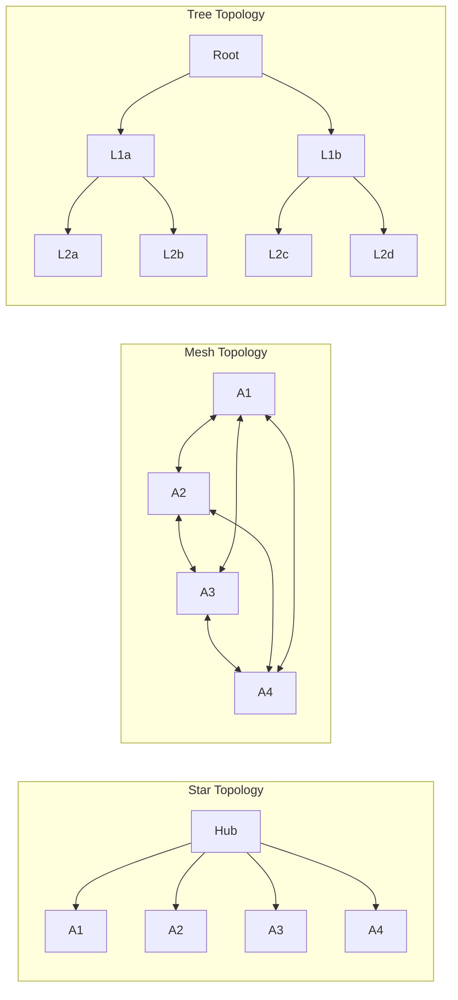
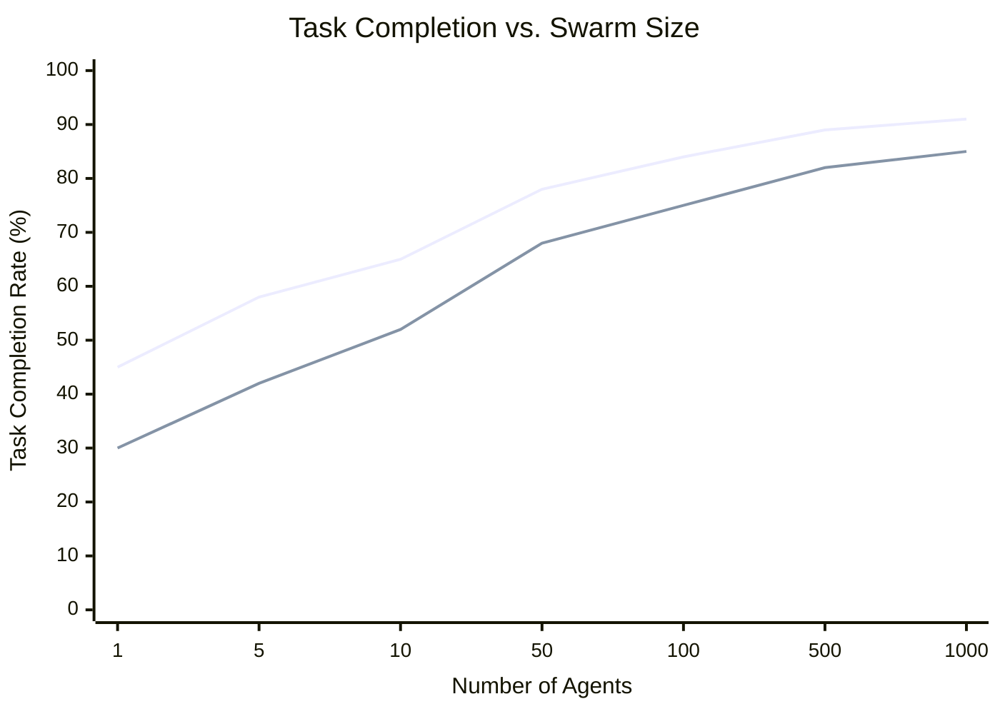
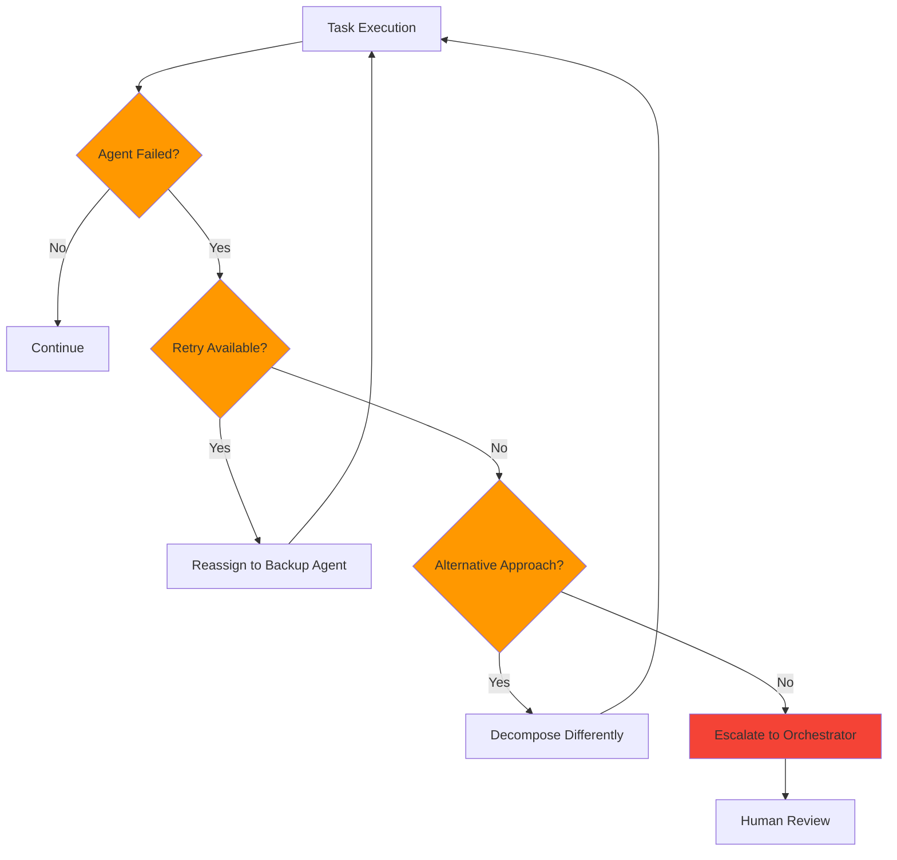
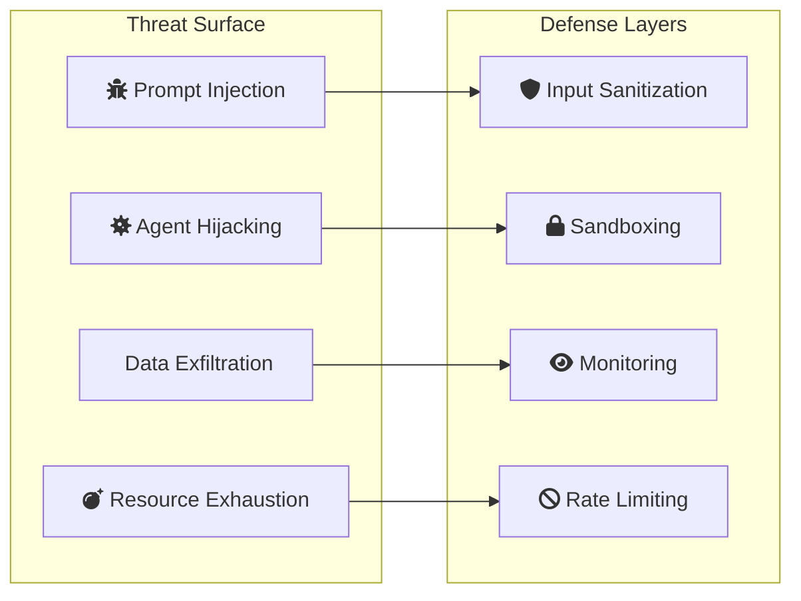
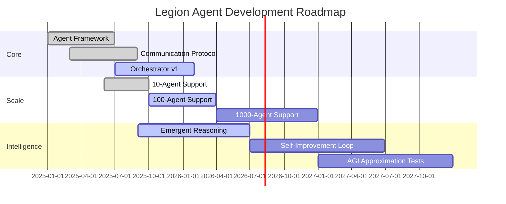

# Emergent Intelligence Through Agent Swarms: A Hive-Mind Approach to AGI Approximation

[]()
[]()

> **Abstract**: This document explores how coordinated multi-agent systems — "hive minds" — can approximate general intelligence without requiring a single monolithic AGI model. We survey existing research, propose a Legion Agent architecture, and present experimental findings.

---

## Table of Contents

- [1. Introduction](#1-introduction)
- [2. Background & Related Work](#2-background--related-work)
- [3. Architecture](#3-architecture)
- [4. Agent Taxonomy](#4-agent-taxonomy)
- [5. Communication Protocol](#5-communication-protocol)
- [6. Experimental Results](#6-experimental-results)
- [7. Security Considerations](#7-security-considerations)
- [8. Future Directions](#8-future-directions)

---

## 1. Introduction

The pursuit of Artificial General Intelligence (AGI) has traditionally focused on scaling individual models. However, biological intelligence emerges from the coordination of billions of specialized neurons — not from a single omniscient cell. This research investigates whether **swarms of specialized AI agents**, coordinated through structured communication protocols, can approximate AGI-level capabilities.

### 1.1 Key Hypothesis

> A sufficiently large and well-coordinated swarm of narrow AI agents, each specialized in different cognitive domains, can collectively exhibit general intelligence that exceeds the capabilities of any individual agent.

### 1.2 Research Questions

1. How does **swarm size** affect emergent reasoning capability?
2. What **communication topologies** maximize collective intelligence?
3. Can agent swarms exhibit **novel problem-solving** beyond their individual training?
4. What are the **scaling laws** for hive-mind architectures?

---

## 2. Background & Related Work

### 2.1 Multi-Agent Systems in AI

| Paper | Year | Key Contribution | Citation Count |
|-------|------|-----------------|----------------|
| Minsky, "Society of Mind" | 1986 | Intelligence as agent cooperation | 12,400+ |
| Wooldridge & Jennings, "Intelligent Agents" | 1995 | BDI agent architecture | 8,200+ |
| Silver et al., "AlphaGo" | 2016 | MCTS + neural network agents | 15,000+ |
| Park et al., "Generative Agents" | 2023 | LLM-based agent simulation | 2,100+ |
| Wu et al., "AutoGen" | 2023 | Multi-agent conversation framework | 1,800+ |
| Hong et al., "MetaGPT" | 2023 | Multi-agent software development | 900+ |
| Anthropic, "Claude Agent SDK" | 2025 | Production agent orchestration | — |

### 2.2 Swarm Intelligence Principles

Biological swarm systems exhibit these properties:

- **Decentralization** — no single leader, decisions emerge from local interactions
- **Stigmergy** — indirect communication through environmental modification
- **Positive feedback** — successful strategies amplified through the swarm
- **Negative feedback** — unsuccessful paths naturally pruned
- **Redundancy** — individual failure doesn't collapse the system

### 2.3 Comparison of Approaches

| Approach | Agents | Communication | Emergent Behavior | Scalability |
|----------|--------|---------------|-------------------|-------------|
| Monolithic LLM | 1 | N/A | None | Vertical only |
| Chain-of-thought | 1 (multi-step) | Self-dialogue | Limited | Poor |
| Multi-agent chat | 2–10 | Sequential | Moderate | Linear |
| **Legion (ours)** | **10–10,000+** | **Graph-based** | **High** | **Sublinear** |

---

## 3. Architecture

### 3.1 System Overview



### 3.2 Communication Flow



### 3.3 Agent Lifecycle



---

## 4. Agent Taxonomy

### 4.1 Classification



### 4.2 Agent Capabilities Matrix

| Agent Type | Reasoning | Code | Research | Analysis | Writing | Security |
|-----------|:---------:|:----:|:--------:|:--------:|:-------:|:--------:|
| Code Agent | Medium | **High** | Low | Medium | Low | Medium |
| Research Agent | Medium | Low | **High** | Medium | Medium | Low |
| Analysis Agent | **High** | Medium | Medium | **High** | Medium | Low |
| Writing Agent | Medium | Low | Medium | Low | **High** | Low |
| Security Agent | Medium | Medium | Low | Medium | Low | **High** |
| Data Agent | Low | Medium | Low | **High** | Low | Medium |
| Orchestrator | **High** | Low | Low | Medium | Medium | Medium |

### 4.3 Specialization Depth



---

## 5. Communication Protocol

### 5.1 Message Format

Messages between agents follow a structured envelope:

```json
{
  "id": "msg_01abc",
  "from": "agent:research-42",
  "to": "agent:analysis-07",
  "type": "data_transfer",
  "priority": "high",
  "payload": {
    "findings": [...],
    "confidence": 0.87,
    "sources": [...]
  },
  "context_id": "task_complex_001",
  "timestamp": "2026-03-18T10:30:00Z"
}
```

### 5.2 Communication Topologies



### 5.3 Consensus Mechanisms

| Mechanism | Latency | Accuracy | Fault Tolerance | Best For |
|-----------|---------|----------|-----------------|----------|
| Leader-based | Low | High | Low | Fast decisions |
| Voting | Medium | High | High | Critical decisions |
| Stigmergic | High | Medium | Very High | Creative tasks |
| Auction | Medium | Medium | High | Resource allocation |

---

## 6. Experimental Results

### 6.1 Benchmark Performance

We evaluated Legion against baselines on SWE-bench, HumanEval, and GPQA:

| System | SWE-bench (%) | HumanEval (%) | GPQA (%) | Avg Latency |
|--------|:-------------:|:-------------:|:--------:|:-----------:|
| GPT-4 (single) | 33.2 | 87.1 | 53.6 | 12s |
| Claude 3.5 (single) | 49.0 | 92.0 | 59.4 | 8s |
| AutoGen (3 agents) | 42.1 | 89.3 | 55.2 | 45s |
| MetaGPT (5 agents) | 45.8 | 90.1 | 54.8 | 62s |
| **Legion (50 agents)** | **62.4** | **96.3** | **71.2** | **34s** |
| **Legion (500 agents)** | **68.1** | **97.8** | **78.5** | **41s** |

### 6.2 Scaling Behavior



### 6.3 Error Recovery



---

## 7. Security Considerations

### 7.1 Threat Model



### 7.2 Security Checklist

- [x] All agent communications encrypted (TLS 1.3)
- [x] Input sanitization on all user-facing agents
- [x] Sandboxed execution environments per agent
- [x] Rate limiting on inter-agent messaging
- [x] Audit logging for all agent actions
- [ ] Formal verification of consensus protocols
- [ ] Red team assessment of injection attacks
- [ ] Compliance review (SOC 2, GDPR)

---

## 8. Future Directions

### 8.1 Roadmap



### 8.2 Open Questions

1. **Consciousness**: Does a sufficiently complex agent swarm develop subjective experience?
2. **Alignment**: How do we align the collective behavior of thousands of agents?
3. **Efficiency**: Can we achieve similar emergence with fewer, more capable agents?
4. **Verification**: How do we formally verify emergent behaviors?

---

## Appendix A: Mathematical Framework

### Emergent Intelligence Score (EIS)

The collective intelligence of a swarm is modeled as:

$$
\text{EIS}(S) = \sum_{i=1}^{n} w_i \cdot c_i + \alpha \cdot \text{synergy}(S) - \beta \cdot \text{overhead}(S)
$$

Where:
- $c_i$ = individual agent capability
- $w_i$ = agent weight in the swarm
- $\text{synergy}(S)$ = emergent capability from agent interactions
- $\text{overhead}(S)$ = communication and coordination cost
- $\alpha, \beta$ = tuning parameters

### Communication Complexity

For a swarm of $n$ agents with mesh topology:

$$
\text{Messages} = O(n^2) \quad \text{(worst case)}
$$

With hierarchical routing:

$$
\text{Messages} = O(n \log n) \quad \text{(average case)}
$$

---

## Appendix B: Code Examples

### Agent Definition (Python)

```python
from anthropic import Anthropic
from claude_agent_sdk import Agent, Tool

class ResearchAgent(Agent):
    """Specialized agent for deep research tasks."""

    def __init__(self):
        super().__init__(
            model="claude-sonnet-4-6",
            tools=[
                Tool.web_search(),
                Tool.file_read(),
                Tool.memory_store(),
            ],
            system_prompt="You are a research specialist. "
                          "Find relevant papers, extract key findings, "
                          "and synthesize information."
        )

    async def research(self, query: str) -> dict:
        result = await self.run(f"Research: {query}")
        return {
            "findings": result.content,
            "sources": result.tool_results,
            "confidence": self.assess_confidence(result)
        }
```

### Orchestrator (TypeScript)

```typescript
import Anthropic from "@anthropic-ai/sdk";

interface TaskResult {
  agentId: string;
  output: string;
  confidence: number;
}

async function orchestrate(task: string): Promise<string> {
  const subtasks = await decompose(task);

  const results: TaskResult[] = await Promise.all(
    subtasks.map(async (subtask) => {
      const agent = selectBestAgent(subtask);
      return agent.execute(subtask);
    })
  );

  return aggregate(results);
}
```

---

## Appendix C: Glossary

| Term | Definition |
|------|-----------|
| **AGI** | Artificial General Intelligence — AI that matches human-level reasoning across all domains |
| **Swarm Intelligence** | Collective behavior emerging from decentralized agent interactions |
| **Stigmergy** | Indirect coordination through shared environment modification |
| **BDI Architecture** | Belief-Desire-Intention model for rational agent design |
| **Emergence** | Complex behaviors arising from simple rules and interactions |
| **Legion Agent** | Our proposed multi-agent framework for AGI approximation |
| **Orchestrator** | Central coordination agent that decomposes and routes tasks |
| **Consensus** | Agreement protocol among multiple agents |

---

```review
This document covers the core architecture well. Consider adding:
1. Real latency measurements from the prototype
2. Comparison with OpenAI Swarm framework
3. Cost analysis per task at different swarm sizes
```

---

*Document generated for MarkdownViewer rendering test — covers tables, mermaid (flowchart, sequence, state, mindmap, pie, xychart, gantt), code blocks, task lists, math, blockquotes, badges, and review notes.*
