# Diagram & Visualization Showcase

> Comprehensive demo of all diagram types and visual styles supported by MarkdownViewer.

---

## 1. Mermaid Diagram Types

### 1.1 Flowchart (with styling)

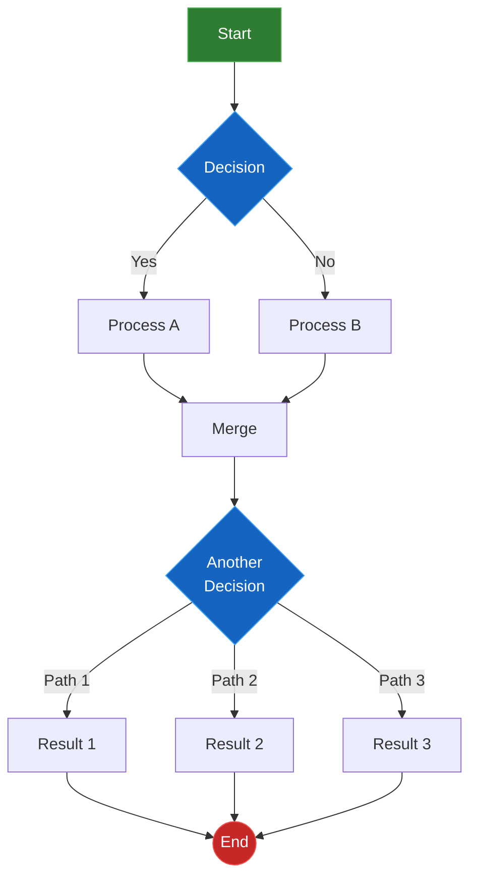

### 1.2 Flowchart — Subgraphs

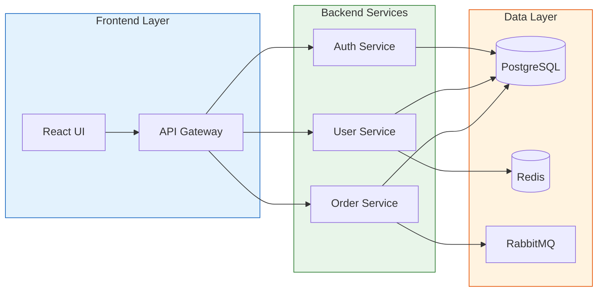

### 1.3 Sequence Diagram

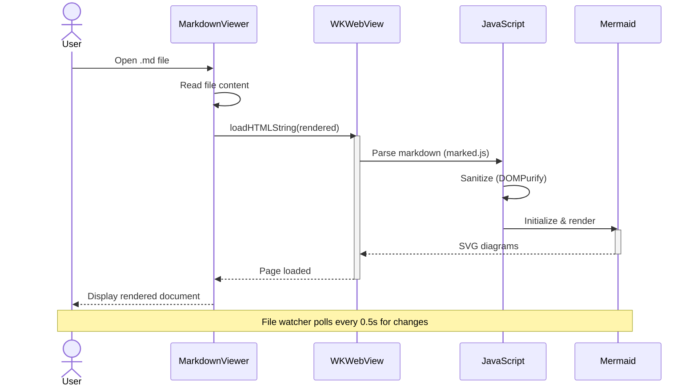

### 1.4 State Diagram

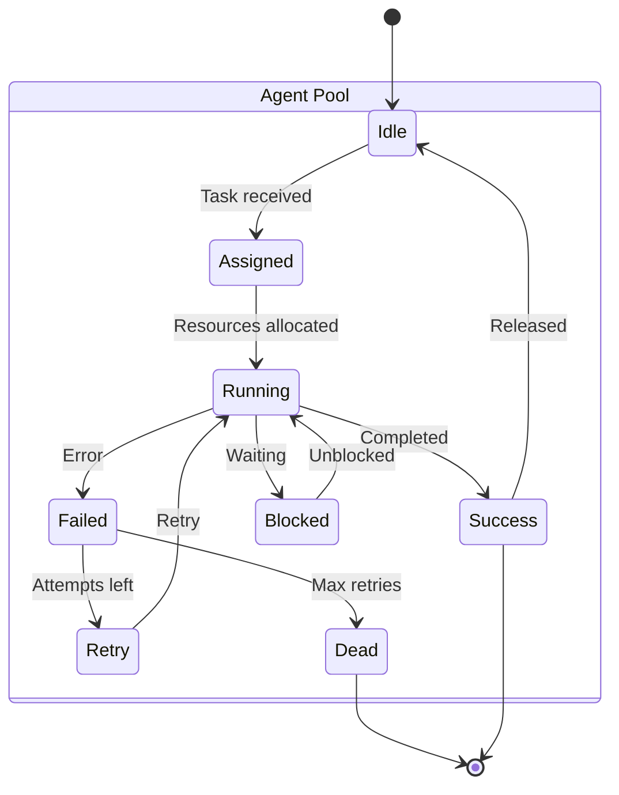

### 1.5 Class Diagram

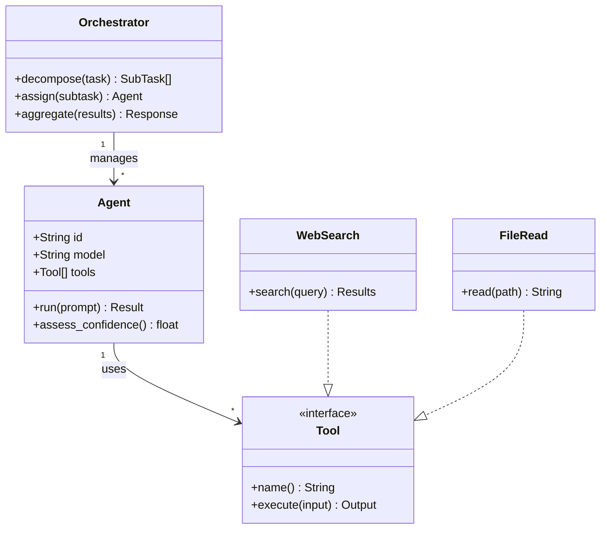

### 1.6 Entity Relationship

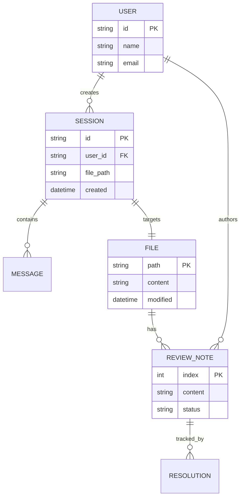

### 1.7 Gantt Chart

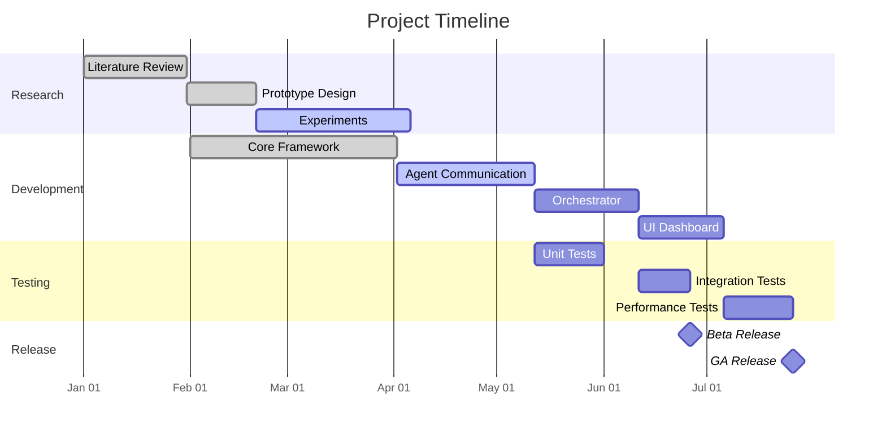

### 1.8 Pie Chart

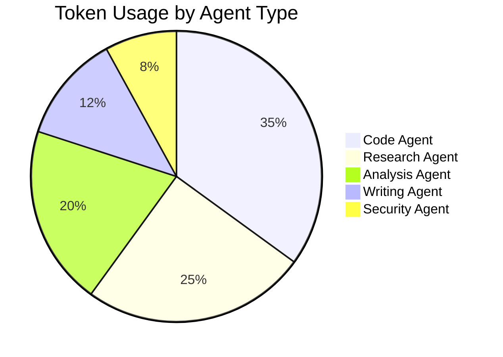

### 1.9 Mindmap

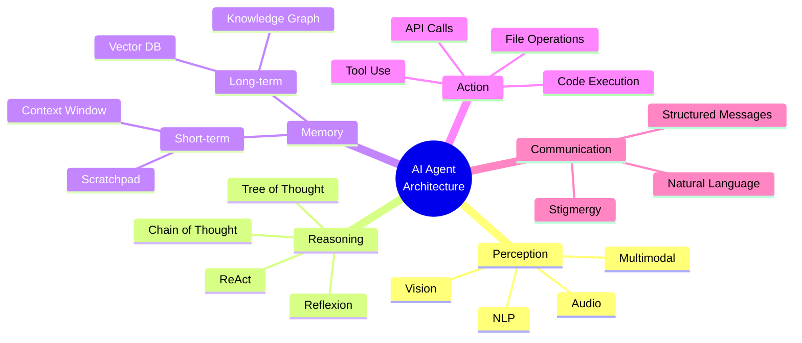

### 1.10 XY Chart

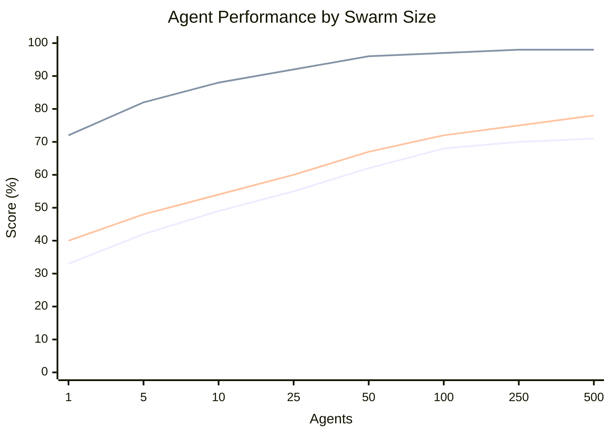

### 1.11 User Journey

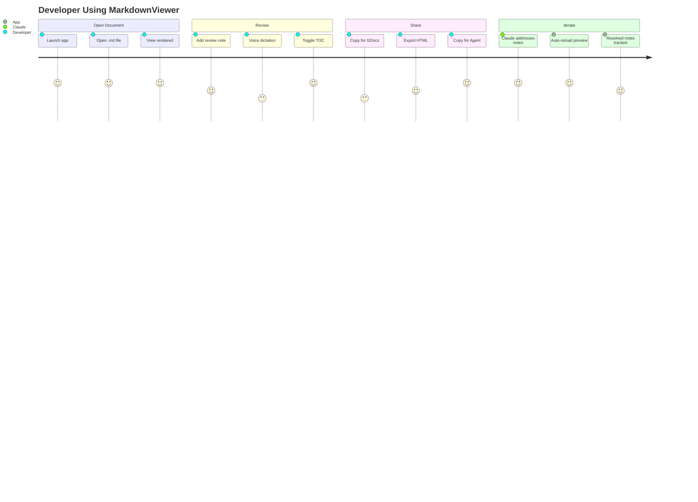

### 1.12 Quadrant Chart

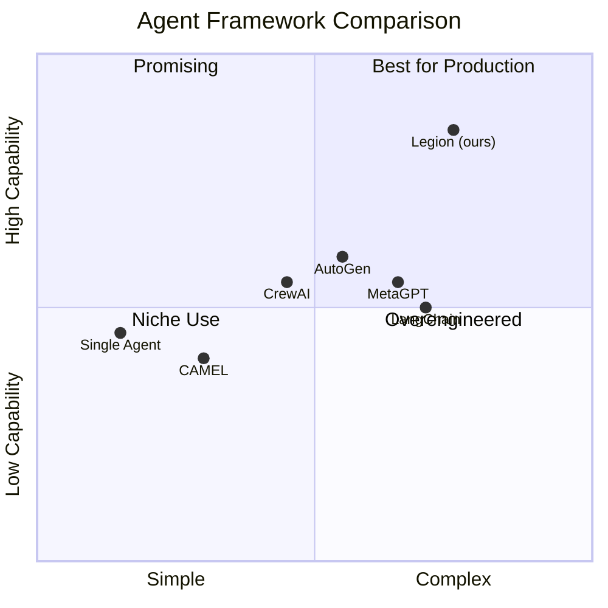

### 1.13 Timeline

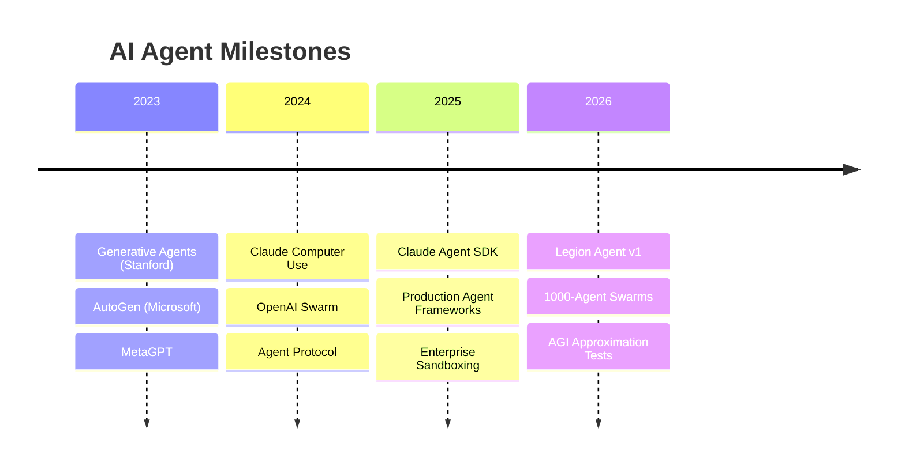

---

## 2. Animated SVG Visualizations

### 2.1 Neural Network Pulse

<svg width="600" height="250" xmlns="http://www.w3.org/2000/svg">
  
  <rect class="nn-bg" width="600" height="250" rx="10"/>
  <text class="nn-t" x="300" y="22" text-anchor="middle" font-family="system-ui" font-size="12" font-weight="600">Neural Network — Signal Propagation</text>
  <!-- Layer labels -->
  <text class="nn-t" x="80" y="235" text-anchor="middle" font-family="system-ui" font-size="9">Input</text>
  <text class="nn-t" x="220" y="235" text-anchor="middle" font-family="system-ui" font-size="9">Hidden 1</text>
  <text class="nn-t" x="380" y="235" text-anchor="middle" font-family="system-ui" font-size="9">Hidden 2</text>
  <text class="nn-t" x="520" y="235" text-anchor="middle" font-family="system-ui" font-size="9">Output</text>
  <!-- Connections (drawn first, behind nodes) -->
  <g opacity="0.2">
    <!-- Input to Hidden 1 -->
    <line class="nn-l" x1="80" y1="60" x2="220" y2="50" stroke-width="1"/>
    <line class="nn-l" x1="80" y1="60" x2="220" y2="110" stroke-width="1"/>
    <line class="nn-l" x1="80" y1="60" x2="220" y2="170" stroke-width="1"/>
    <line class="nn-l" x1="80" y1="120" x2="220" y2="50" stroke-width="1"/>
    <line class="nn-l" x1="80" y1="120" x2="220" y2="110" stroke-width="1"/>
    <line class="nn-l" x1="80" y1="120" x2="220" y2="170" stroke-width="1"/>
    <line class="nn-l" x1="80" y1="180" x2="220" y2="50" stroke-width="1"/>
    <line class="nn-l" x1="80" y1="180" x2="220" y2="110" stroke-width="1"/>
    <line class="nn-l" x1="80" y1="180" x2="220" y2="170" stroke-width="1"/>
    <!-- Hidden 1 to Hidden 2 -->
    <line class="nn-l" x1="220" y1="50" x2="380" y2="70" stroke-width="1"/>
    <line class="nn-l" x1="220" y1="50" x2="380" y2="140" stroke-width="1"/>
    <line class="nn-l" x1="220" y1="110" x2="380" y2="70" stroke-width="1"/>
    <line class="nn-l" x1="220" y1="110" x2="380" y2="140" stroke-width="1"/>
    <line class="nn-l" x1="220" y1="170" x2="380" y2="70" stroke-width="1"/>
    <line class="nn-l" x1="220" y1="170" x2="380" y2="140" stroke-width="1"/>
    <!-- Hidden 2 to Output -->
    <line class="nn-l" x1="380" y1="70" x2="520" y2="110" stroke-width="1"/>
    <line class="nn-l" x1="380" y1="140" x2="520" y2="110" stroke-width="1"/>
  </g>
  <!-- Input neurons -->
  <circle class="nn-n" cx="80" cy="60" r="10"><animate attributeName="r" values="10;13;10" dur="2s" repeatCount="indefinite"/></circle>
  <circle class="nn-n" cx="80" cy="120" r="10"><animate attributeName="r" values="10;13;10" dur="2s" begin="0.2s" repeatCount="indefinite"/></circle>
  <circle class="nn-n" cx="80" cy="180" r="10"><animate attributeName="r" values="10;13;10" dur="2s" begin="0.4s" repeatCount="indefinite"/></circle>
  <!-- Hidden 1 neurons -->
  <circle class="nn-n" cx="220" cy="50" r="10"><animate attributeName="r" values="10;13;10" dur="2s" begin="0.6s" repeatCount="indefinite"/></circle>
  <circle class="nn-n" cx="220" cy="110" r="10"><animate attributeName="r" values="10;13;10" dur="2s" begin="0.8s" repeatCount="indefinite"/></circle>
  <circle class="nn-n" cx="220" cy="170" r="10"><animate attributeName="r" values="10;13;10" dur="2s" begin="1.0s" repeatCount="indefinite"/></circle>
  <!-- Hidden 2 neurons -->
  <circle class="nn-n" cx="380" cy="70" r="10"><animate attributeName="r" values="10;13;10" dur="2s" begin="1.2s" repeatCount="indefinite"/></circle>
  <circle class="nn-n" cx="380" cy="140" r="10"><animate attributeName="r" values="10;13;10" dur="2s" begin="1.4s" repeatCount="indefinite"/></circle>
  <!-- Output neuron -->
  <circle class="nn-sig" cx="520" cy="110" r="14"><animate attributeName="r" values="14;18;14" dur="2s" begin="1.6s" repeatCount="indefinite"/></circle>
  <text x="520" y="114" text-anchor="middle" fill="white" font-family="system-ui" font-size="8" font-weight="600">OUT</text>
  <!-- Signal propagation dots -->
  <circle class="nn-sig" r="3"><animateMotion dur="2s" repeatCount="indefinite" path="M80,60 L220,110"/></circle>
  <circle class="nn-sig" r="3"><animateMotion dur="2s" begin="0.5s" repeatCount="indefinite" path="M80,120 L220,50"/></circle>
  <circle class="nn-sig" r="3"><animateMotion dur="2s" begin="1s" repeatCount="indefinite" path="M220,110 L380,70"/></circle>
  <circle class="nn-sig" r="3"><animateMotion dur="2s" begin="1.5s" repeatCount="indefinite" path="M380,70 L520,110"/></circle>
</svg>

### 2.2 Orbiting Agent Swarm

<svg width="400" height="400" xmlns="http://www.w3.org/2000/svg">
  
  <rect class="orb-bg" width="400" height="400" rx="10"/>
  <!-- Orbit rings -->
  <circle class="orb-ring" cx="200" cy="200" r="60" fill="none" stroke-width="1" stroke-dasharray="4,4"/>
  <circle class="orb-ring" cx="200" cy="200" r="110" fill="none" stroke-width="1" stroke-dasharray="4,4"/>
  <circle class="orb-ring" cx="200" cy="200" r="160" fill="none" stroke-width="1" stroke-dasharray="4,4"/>
  <!-- Central hub -->
  <circle class="orb-c" cx="200" cy="200" r="25"/>
  <circle class="orb-c" cx="200" cy="200" r="30" opacity="0.2">
    <animate attributeName="r" values="30;38;30" dur="3s" repeatCount="indefinite"/>
    <animate attributeName="opacity" values="0.2;0.05;0.2" dur="3s" repeatCount="indefinite"/>
  </circle>
  <text x="200" y="204" text-anchor="middle" fill="white" font-family="system-ui" font-size="9" font-weight="700">CORE</text>
  <!-- Inner orbit agents (fast) -->
  <circle class="orb-a1" r="10">
    <animateMotion dur="4s" repeatCount="indefinite" path="M200,200 m-60,0 a60,60 0 1,1 120,0 a60,60 0 1,1 -120,0"/>
  </circle>
  <circle class="orb-a2" r="10">
    <animateMotion dur="4s" begin="2s" repeatCount="indefinite" path="M200,200 m-60,0 a60,60 0 1,1 120,0 a60,60 0 1,1 -120,0"/>
  </circle>
  <!-- Middle orbit agents (medium) -->
  <circle class="orb-a3" r="12">
    <animateMotion dur="7s" repeatCount="indefinite" path="M200,200 m-110,0 a110,110 0 1,1 220,0 a110,110 0 1,1 -220,0"/>
  </circle>
  <circle class="orb-a1" r="12">
    <animateMotion dur="7s" begin="2.3s" repeatCount="indefinite" path="M200,200 m-110,0 a110,110 0 1,1 220,0 a110,110 0 1,1 -220,0"/>
  </circle>
  <circle class="orb-a4" r="12">
    <animateMotion dur="7s" begin="4.6s" repeatCount="indefinite" path="M200,200 m-110,0 a110,110 0 1,1 220,0 a110,110 0 1,1 -220,0"/>
  </circle>
  <!-- Outer orbit agents (slow) -->
  <circle class="orb-a2" r="8">
    <animateMotion dur="11s" repeatCount="indefinite" path="M200,200 m-160,0 a160,160 0 1,1 320,0 a160,160 0 1,1 -320,0"/>
  </circle>
  <circle class="orb-a3" r="8">
    <animateMotion dur="11s" begin="2.75s" repeatCount="indefinite" path="M200,200 m-160,0 a160,160 0 1,1 320,0 a160,160 0 1,1 -320,0"/>
  </circle>
  <circle class="orb-a4" r="8">
    <animateMotion dur="11s" begin="5.5s" repeatCount="indefinite" path="M200,200 m-160,0 a160,160 0 1,1 320,0 a160,160 0 1,1 -320,0"/>
  </circle>
  <circle class="orb-a1" r="8">
    <animateMotion dur="11s" begin="8.25s" repeatCount="indefinite" path="M200,200 m-160,0 a160,160 0 1,1 320,0 a160,160 0 1,1 -320,0"/>
  </circle>
  <text class="orb-t" x="200" y="385" text-anchor="middle" font-family="system-ui" font-size="10">Agent Swarm — 3 orbital layers, 9 agents</text>
</svg>

### 2.3 Heartbeat Monitor

<svg width="600" height="150" xmlns="http://www.w3.org/2000/svg">
  
  <rect class="hb-bg" width="600" height="150" rx="8"/>
  <!-- Grid -->
  <g class="hb-grid" stroke-width="0.5">
    <line x1="0" y1="37" x2="600" y2="37"/><line x1="0" y1="75" x2="600" y2="75"/><line x1="0" y1="112" x2="600" y2="112"/>
  </g>
  <text class="hb-t" x="10" y="15" font-family="system-ui" font-size="10" font-weight="600">System Health Monitor</text>
  <text class="hb-t" x="530" y="15" font-family="system-ui" font-size="9">LIVE</text>
  <circle class="hb-dot" cx="520" cy="12" r="3"><animate attributeName="opacity" values="1;0.3;1" dur="1s" repeatCount="indefinite"/></circle>
  <!-- ECG-style path -->
  <path class="hb-line" fill="none" stroke-width="2" stroke-linecap="round" stroke-linejoin="round"
    d="M0,75 L40,75 L50,75 L55,60 L60,90 L65,30 L70,120 L75,50 L80,75 L120,75 L160,75 L170,75 L175,60 L180,90 L185,30 L190,120 L195,50 L200,75 L240,75 L280,75 L290,75 L295,60 L300,90 L305,30 L310,120 L315,50 L320,75 L360,75 L400,75 L410,75 L415,60 L420,90 L425,30 L430,120 L435,50 L440,75 L480,75 L520,75 L530,75 L535,60 L540,90 L545,30 L550,120 L555,50 L560,75 L600,75">
    <animate attributeName="stroke-dasharray" values="0,2000;2000,0" dur="4s" repeatCount="indefinite"/>
  </path>
  <text class="hb-t" x="10" y="140" font-family="system-ui" font-size="9">72 BPM — All agents healthy — Latency: 34ms avg</text>
</svg>

### 2.4 Data Flow Waterfall

<svg width="500" height="300" xmlns="http://www.w3.org/2000/svg">
  
  <rect class="wf-bg" width="500" height="300" rx="10"/>
  <text class="wf-t" x="250" y="25" text-anchor="middle" font-family="system-ui" font-size="13" font-weight="600">Data Processing Waterfall</text>
  <!-- Stage 1: Ingest -->
  <rect class="wf-box" x="30" y="45" width="140" height="50" rx="8" stroke-width="1"/>
  <text class="wf-t" x="100" y="67" text-anchor="middle" font-family="system-ui" font-size="11" font-weight="600">Ingest</text>
  <text class="wf-st" x="100" y="82" text-anchor="middle" font-family="system-ui" font-size="9">Raw data streams</text>
  <!-- Arrow 1 -->
  <line class="wf-arrow" x1="170" y1="70" x2="180" y2="70" stroke-width="1.5"/>
  <line class="wf-arrow" x1="180" y1="70" x2="200" y2="130" stroke-width="1.5"/>
  <!-- Data drops -->
  <circle class="wf-d1" r="4"><animateMotion dur="2s" repeatCount="indefinite" path="M100,95 C100,110 200,110 200,130"/></circle>
  <circle class="wf-d1" r="4"><animateMotion dur="2s" begin="0.5s" repeatCount="indefinite" path="M100,95 C120,115 180,115 200,130"/></circle>
  <circle class="wf-d1" r="4"><animateMotion dur="2s" begin="1s" repeatCount="indefinite" path="M100,95 C80,120 220,120 200,130"/></circle>
  <!-- Stage 2: Transform -->
  <rect class="wf-box" x="180" y="120" width="140" height="50" rx="8" stroke-width="1"/>
  <text class="wf-t" x="250" y="142" text-anchor="middle" font-family="system-ui" font-size="11" font-weight="600">Transform</text>
  <text class="wf-st" x="250" y="157" text-anchor="middle" font-family="system-ui" font-size="9">Clean, normalize, enrich</text>
  <!-- Arrow 2 -->
  <line class="wf-arrow" x1="320" y1="145" x2="330" y2="145" stroke-width="1.5"/>
  <line class="wf-arrow" x1="330" y1="145" x2="350" y2="205" stroke-width="1.5"/>
  <!-- Data drops -->
  <circle class="wf-d2" r="4"><animateMotion dur="2s" begin="0.7s" repeatCount="indefinite" path="M250,170 C250,185 350,185 350,205"/></circle>
  <circle class="wf-d2" r="4"><animateMotion dur="2s" begin="1.2s" repeatCount="indefinite" path="M250,170 C270,190 330,190 350,205"/></circle>
  <!-- Stage 3: Analyze -->
  <rect class="wf-box" x="330" y="195" width="140" height="50" rx="8" stroke-width="1"/>
  <text class="wf-t" x="400" y="217" text-anchor="middle" font-family="system-ui" font-size="11" font-weight="600">Analyze</text>
  <text class="wf-st" x="400" y="232" text-anchor="middle" font-family="system-ui" font-size="9">ML inference + scoring</text>
  <!-- Result indicator -->
  <circle class="wf-d3" cx="400" cy="270" r="8">
    <animate attributeName="r" values="8;12;8" dur="1.5s" repeatCount="indefinite"/>
    <animate attributeName="opacity" values="1;0.5;1" dur="1.5s" repeatCount="indefinite"/>
  </circle>
  <text class="wf-st" x="400" y="290" text-anchor="middle" font-family="system-ui" font-size="9">Output ready</text>
</svg>

---

## 3. Complex Mermaid Patterns

### 3.1 C4 Architecture (Context)

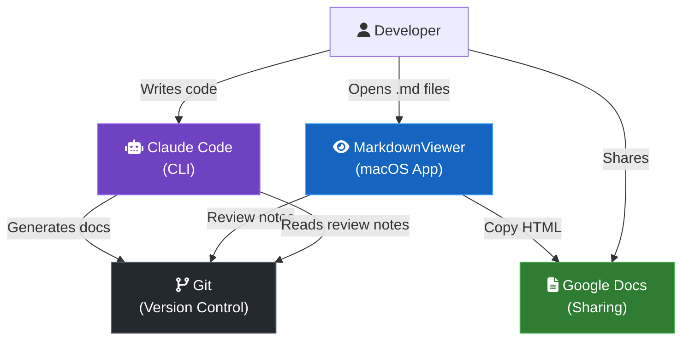

### 3.2 Decision Tree

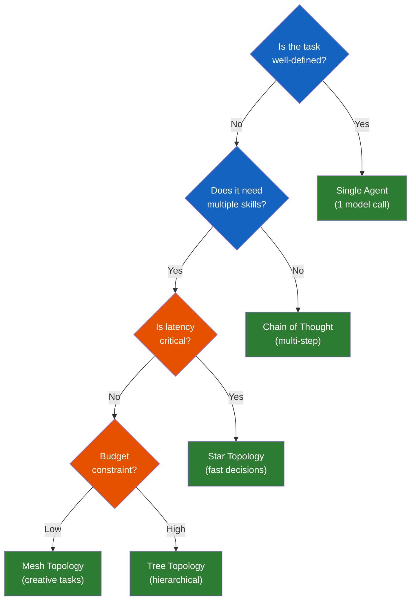

---

*Showcase covers: 13 mermaid diagram types (flowchart, subgraphs, sequence, state, class, ER, gantt, pie, mindmap, xychart, journey, quadrant, timeline) + 4 animated SVGs (neural network, orbital swarm, heartbeat monitor, data waterfall) + complex patterns (C4, decision tree).*
